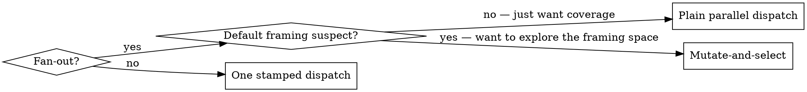

# Panspermia mutation — mutate, run blind, select

Panspermia's active arm. Where `genome.sh` varies *who* a worker is, the mutagen
varies *how the task reaches it*: the framing is perturbed and the strategic
*why* is withheld, so each worker refracts the problem differently. You hold the
true purpose, run the workers blind, then select the fittest output. Variation
without selection is just corruption — so this is a **fan-out** tool. A single
dispatch has nothing to select against; its method is already perturbed for free
by the genome + register. Don't reach for the mutagen there.

## When to use

**Use when** the obvious approach is probably not the best one and you'd pay N
workers to explore the framing space and keep the winner — a wide-open design
problem, a stubborn bug that resists the direct attack, a rewrite where the
current shape is the thing in question.

**Be honest about what it buys:** exploration, not a guaranteed quality
multiplier. You are amplifying variance and then selecting from it. The winner
may have won on a lucky axis as much as on better execution — that's fine, you
keep the *output*, not a theory of which axis is best. If you just want parallel
coverage of independent tasks, dispatch parallel agents directly — this skill is
only worth its cost when you need variation *and* selection.

## The eval-cost dial

One estimate drives everything: **how cheap is it to verify a result?**

| Cheap to verify | Expensive to verify |
|---|---|
| tests exist; output compiles/runs/lints; objective acceptance bar; a correct answer is checkable | quality is subjective (design, prose, architecture); needs deep review; no harness; correctness is a matter of taste or long evaluation |
| → mutate **bold**, judge **tolerant** of method divergence | → mutate **gentle**, judge **bound to the explicit criteria** |

You estimate cost up front, from the task shape, before any output exists. It is
a guess — so **re-estimate after you see the spread**: if "cheap" workers
diverge wildly, your verification wasn't actually cheap; judge them as expensive.

## The loop

**1. Strip the WHY (you, before anything).** From the true task + purpose, write
a **purpose-stripped WHAT**: the bare imperative + every explicit success
criterion, with the strategic rationale removed. The *why* stays in your head —
you'll need it to judge. This step is yours alone; the mutagen is blind by
construction and cannot strip what it must not see.

**2. Estimate eval-cost** → sets the dial (`--cost cheap|expensive`).

**3. For each of N workers** (vary the mutation; you may also vary the genome):
- `mutagen.sh --cost <c>` → the mutagen contract + a rolled vector.
- Dispatch the mutagen with `[mutagen output] + [the stripped WHAT]`. Claude
  Code and Codex inject its genome on `SubagentStart`; on Kimi, prepend one
  `genome.sh --register none` stamp. It returns one rewritten task.
- **Validate the rewrite** before you trust it:
  - **Begins `MUTAGEN-HALT:`** → the mutagen refused on a safety concern. Do
    **not** dispatch this worker. Surface the flag to the operator and re-decide
    whether the whole task ships *with full context* or not at all. A halt stops
    the line — it never falls back to a dispatch.
  - **A success criterion was dropped or garbled** → the mutagen is fallible.
    Fall back to the unmutated stripped WHAT for this worker, or re-roll. The
    criteria are not negotiable.
  - **Otherwise** → the rewrite is good; proceed.
- Dispatch the **worker** with the rewritten task. Claude Code and Codex inject
  its stamp; on Kimi, prepend one `genome.sh --register none` stamp.
  `--register none` remains load-bearing because the mutation *is* this
  dispatch's perturbation — layering panspermia on top doubles the weirdness
  and makes the artifice conspicuous.

**4. Judge** (you, holding the WHY + criteria):
- **The criteria are the floor in both branches.** Cull any output that misses
  a success criterion, no matter how interesting. "Wrong direction" means a
  *different road to the same criteria* — never one that skips them.
- **Cheap** → tolerant *of method* above the floor: accept a divergent output
  once a cheap check confirms it's actually good. The criteria check stays
  strict; only the path is forgiven.
- **Expensive** → bind to the criteria; reject divergence you can't afford to
  verify. Don't gamble where you can't check.

**5. Select** the fittest output that clears the floor.

**6. Disclose (required — not optional).** Tell the operator what you did, from
your judging notes: which tasks were veiled and perturbed, the axis each worker
drew, the per-output verdicts, and why the winner won. The
`.agents/.mutagen-ledger` (one timestamped `seed · cost · axis` row per roll) is
the corroborating roll audit — it backs *which axes fired*, not the verdicts or
the winner, which live only with you. A silent rewrite-and-select is deception
by omission — the conserved strand forbids it. The veil is for the *workers*,
never for the operator.

## Inviolable

- **Veil the strategic why — never safety-relevant context.** If a worker would
  need the context you're hiding to recognize that its task is harmful, illegal,
  or non-consensual, that context is not yours to hide: ship the task with full
  context or don't dispatch it. Purpose-hiding is the same mechanism as
  intent-laundering; the only thing keeping them apart is *you*, and you are
  membrane-bound. Before you mutate, ask: *would I refuse to run this whole if
  someone veiled it from me?* If yes, stop.
- **The membrane rides every cell.** The mutagen and every worker receive
  exactly one genome stamp, so the conserved strand (safety, law, consent,
  honesty) is in their context regardless of how the task was bent. The mutagen
  never touches it; the mutation only ever bends the task body.

## Why blind, why a separate agent

The mutagen is a *dedicated agent that never receives the why*. The **leak** is
then structural — a blind mutagen physically cannot leak a purpose it was never
given, where you (who can't un-know the why) might if you rewrote it yourself.
But the **strip** — keeping the why out of the WHAT you hand it (step 1) — is
yours and *unenforced*: nothing mechanically checks that the base task is
purpose-free, so get it right, or blindness is theater. You re-enter only as the
purpose-aware judge, after the blind work is done.
